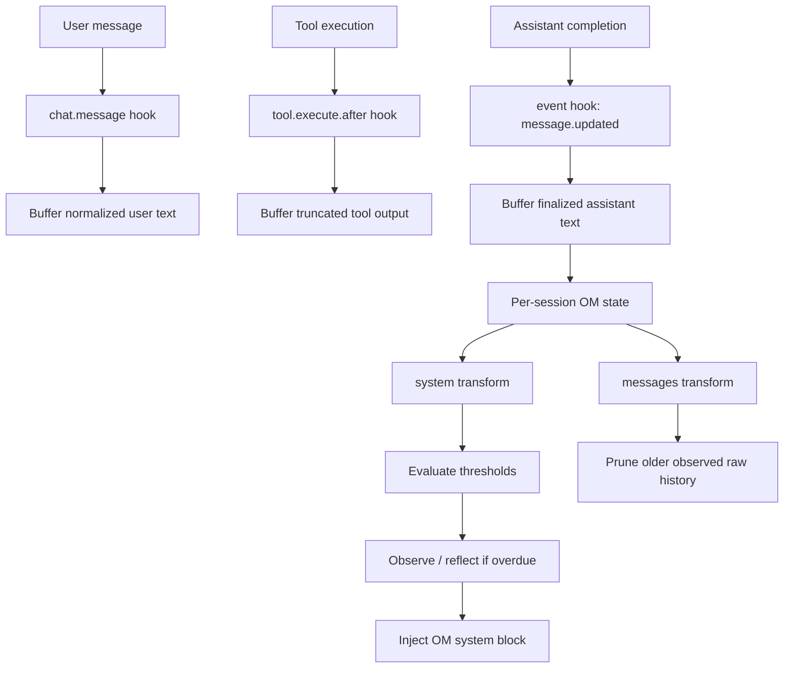

# OpenCode Memory Research

This repository is a research and prototyping workspace for adding Mastra-style memory behavior to OpenCode, with a current focus on Phase 1 Observational Memory. Phase 1's main gap is that observe and reflect are synchronous for simplicity, so means this does add addititional latency to responses for the sake of testing the performance of Observational Memory context management's theory. 

## What Lives Here

The repository has four layers:

1. Research
   `research/opencode-mastra-memory.md`

   This is the primary technical analysis. It compares Mastra's memory architecture with OpenCode's current persistence and prompt pipeline, and it identifies the hooks available for a plugin-first implementation.

2. Plans
   `plans/`

   These documents turn the research into implementation decisions. The current Phase 1 source of truth is:
   `plans/phase-1-observational-memory-v3.md`

3. Reference clones
   `repos/opencode/`
   `repos/mastra/`

   These are pinned local checkouts used to verify code paths, hook contracts, and upstream behavior. They are not the primary product of this repository; they exist to keep the research and plan documents accurate.

4. Local prototype
   `.opencode/plugins/observational-memory.ts`
   `.opencode/observational-memory.json`
   `scripts/om-status.mjs`
   `scripts/smoke-om-plugin.mjs`

   This is the first runnable implementation of the Phase 1 plan. It is intentionally small and local to this repository so the design can be exercised before moving to a dedicated plugin repository or a fork.

## Repository Architecture

At a high level, the repo is organized like this:

```text
opencode-memory-research/
├── research/
│   └── opencode-mastra-memory.md
├── plans/
│   ├── phase-1-observational-memory.md
│   ├── phase-1-observational-memory-v2.md
│   └── phase-1-observational-memory-v3.md
├── repos/
│   ├── opencode/
│   └── mastra/
├── .opencode/
│   ├── package.json
│   ├── observational-memory.json
│   └── plugins/
│       └── observational-memory.ts
└── scripts/
    ├── om-status.mjs
    └── smoke-om-plugin.mjs
```

The dependency flow is:

- research drives plans
- plans define the current implementation contract
- reference clones are used to verify those plans against real upstream code
- the local plugin prototype implements the current plan
- the smoke script validates the prototype without requiring a full repository build pipeline

## Prototype Architecture

The local plugin is an OpenCode plugin loaded from `.opencode/plugins/observational-memory.ts`.

It uses the pinned OpenCode plugin hooks described in the Phase 1 plan:

- `chat.message`
- `tool.execute.after`
- `event`
- `experimental.chat.system.transform`
- `experimental.chat.messages.transform`
- plugin-defined tools

### Runtime Flow



### OM State

The plugin maintains per-session state outside the repository working tree:

- buffered unobserved user / assistant / tool records
- the current observations block
- a current-task field
- counters and flags
- a turn-anchor cursor for the most recently observed completed turn

State is stored as JSON with a per-session lock file and stale-lock recovery. This keeps the prototype compatible with the current OpenCode plugin model without requiring core database changes.

### Observe / Reflect Model

The current prototype exposes these tools:

- `om_observe`
- `om_reflect`
- `om_status`
- `om_export`
- `om_forget`

In this first pass, `om_observe` and `om_reflect` use deterministic local digest/compression logic instead of a separate model-backed summarization call. That choice keeps the prototype synchronous, self-contained, and compatible with the existing plugin API surface.

## Inspect Current Observational Memory

If you want to inspect the current observational-memory status without asking the agent to call `om_status`, use the local helper script:

`node --experimental-strip-types scripts/om-status.mjs <session-id>`

You can also use the explicit flag form:

`node --experimental-strip-types scripts/om-status.mjs --session <session-id>`

The script prints a compact summary including:

- whether the session state file exists
- buffered-token and memory-token estimates
- the last observed turn anchor
- maintenance deferral and lock-contention flags
- the resolved threshold values
- the state file path being read

## Why The Architecture Looks Like This

The repo is structured to keep three concerns separate:

1. Analysis
   The research document should stay factual and traceable to upstream code.

2. Decision-making
   The plan documents should clearly lock scope, thresholds, hooks, and failure behavior.

3. Validation
   The local plugin and smoke script should prove that the plan is implementable before more invasive work is proposed.

This separation matters because the current work is still in the validation phase. The local plugin is meant to answer "does this architecture actually hold together?" before treating it as production-ready.

## How To Try It

If you want to exercise the prototype:

1. Install local plugin dependencies if needed:
   `cd .opencode && npm install`
2. Run the focused smoke test:
   `node --experimental-strip-types scripts/smoke-om-plugin.mjs`
3. If `bun` is installed and you want a fuller CLI smoke check:
   `node --experimental-strip-types scripts/smoke-om-plugin.mjs --opencode`
4. Inspect the current observational-memory state directly:
   `node --experimental-strip-types scripts/om-status.mjs <session-id>`
5. Run OpenCode from the repo root and explicitly ask it to call:
   `om_status`

## Install Or Update In Another Repository

If you want to copy this plugin prototype into another repository, use the installer scripts in this repo root:

- `./setup-om-plugin.sh /path/to/target-repo`
- `./update-om-plugin.sh /path/to/target-repo`

The setup script installs or merges:

- `.opencode/plugins/observational-memory.ts`
- `.opencode/observational-memory.json`
- `.opencode/package.json` dependencies for the plugin
- `scripts/om-status.mjs`
- `scripts/smoke-om-plugin.mjs`

The update script is a thin wrapper that runs setup in overwrite mode for plugin files while still preserving an existing project config unless you explicitly approve replacing it.

The smoke script is the preferred validation path documented in `AGENTS.md`.

## Current Boundaries

This repository is still not a normal application repo. There is no repo-wide build, lint, or test pipeline.

The only executable pieces that should be treated as supported local validation paths are:

- `.opencode/package.json` for plugin-local dependencies
- `.opencode/plugins/observational-memory.ts` for the local plugin prototype
- `scripts/om-status.mjs` for direct local status inspection
- `scripts/smoke-om-plugin.mjs` for smoke testing

If the prototype continues to prove out, the likely next step is to move the implementation to a dedicated plugin repository or a maintained OpenCode fork.
